#Posters & Pictures

Free to print, modify, reuse (even commercially). You can order prints [here](http://prints.corkami.com).

##File formats
###Minimalists

Dissection of a minimal PoC (if possible not empty: "Hello World", a few pixels...)

####Executables
[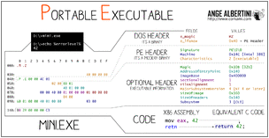](PE.png) [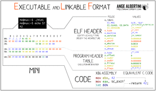](ELF.png) [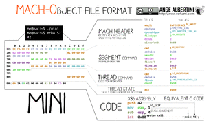](MachO.png) [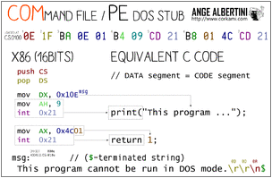](COM.png) [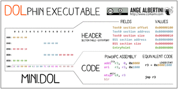](DOL.png) [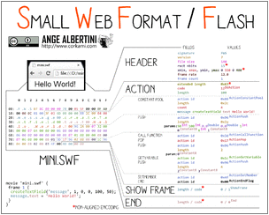](SWF.png) [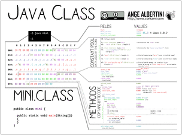](CLASS.png) [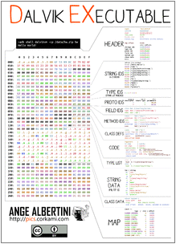](DEX.png) 

####Images
 [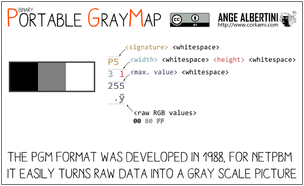](PGM.png) [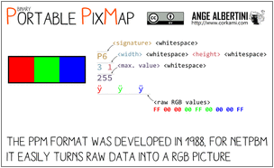](PPM.png) [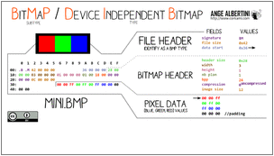](BMP.png) [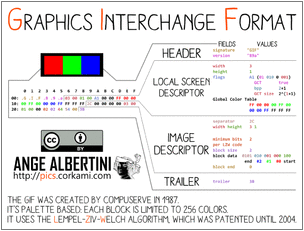](GIF.png) [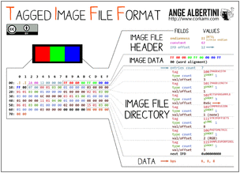](TIFF_LE.png) [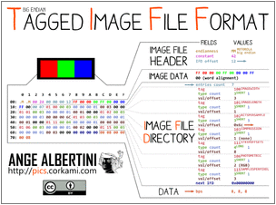](TIFF_BE.png) [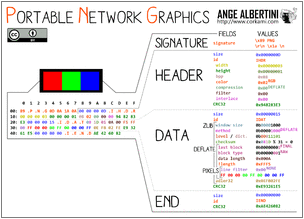](PNG.png) [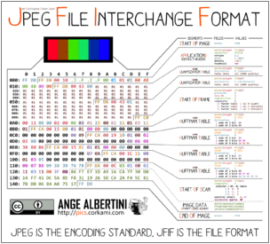](JPG.png)

####Archives
[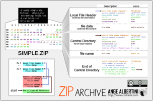](ZIP.png) [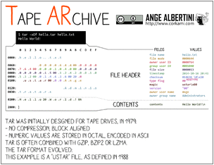](TAR.png) [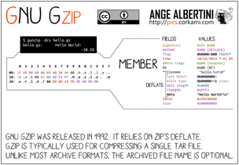](GZip.png) [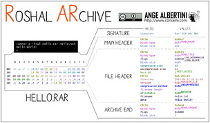](RAR.png) [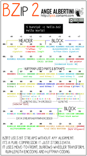](BZ2.png)

####Others
[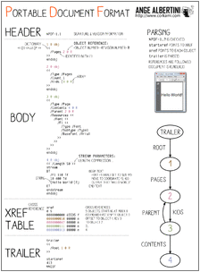](PDF.png) [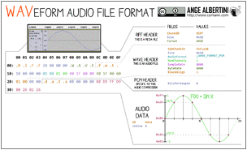](WAV.png) [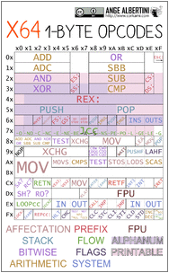](x64.png) [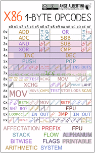](x86.png)

###101

Dissection with more descriptions, and explanations (my initial style of binary posters).
 
 [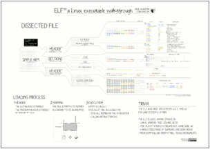](ELF101.png) [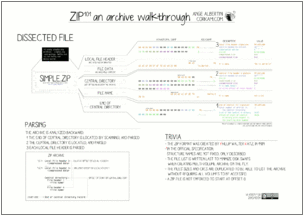](ZIP101.png) [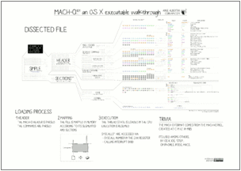](Mach-O101.png) [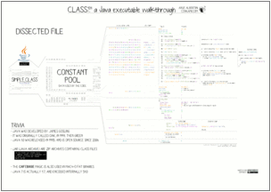](CLASS101.png) [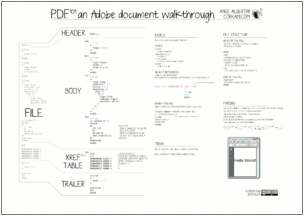](PDF101.png) [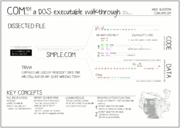](COM101.png) [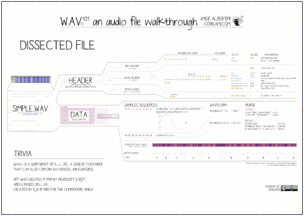](WAV101.png)

###Structures

A layout of the various format's structures

[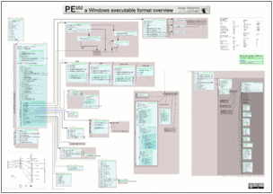](PE102.png)

##Opcodes' tables

Available in compact or 'with descriptions' formats

### Android
[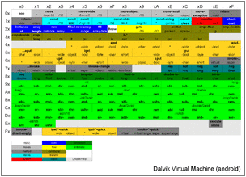](DVM.png) [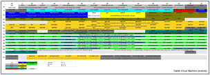](DVMFull.jpg)
### JVM
[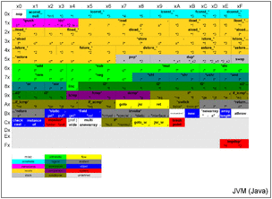](JVM.png) [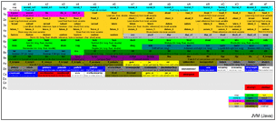](JVMFull.png)
### .Net
[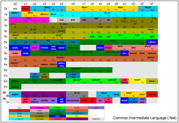](DotNet.png) [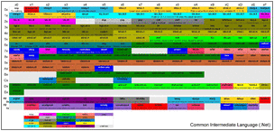](DotNetFull.jpg)

One day, Most of these files will be obsolete ;)

----------

##Cryptography

Jneavat! N qnatrebhf pelcgbtencuvp bowrpg vf urnqvat lbhe jnl....

[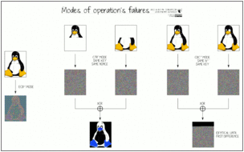](CryptoModes.png)

##Arcade games
Full-res versions of slides for my [Preserving Arcade Games](http://www.youtube.com/watch?v=vg7LPcFUxg8) talk at the 31c3.

[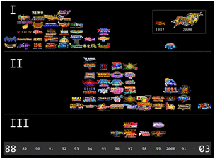](CPSx.png) [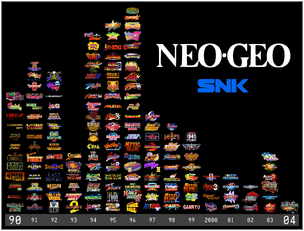](NeoGeo.png) 
