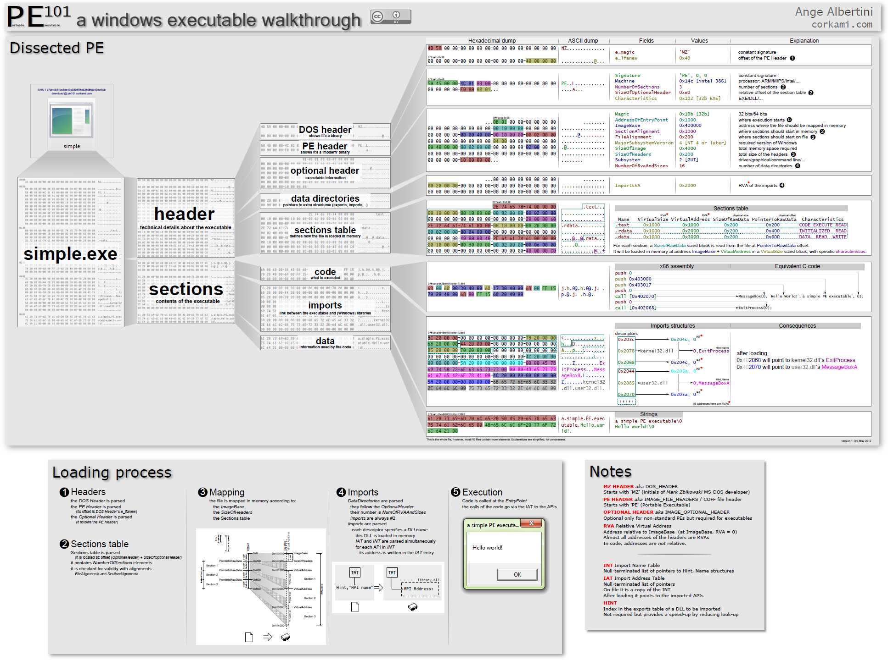
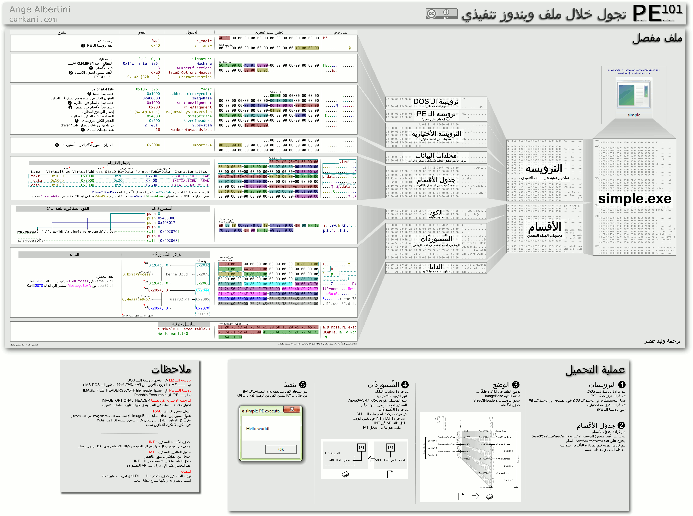
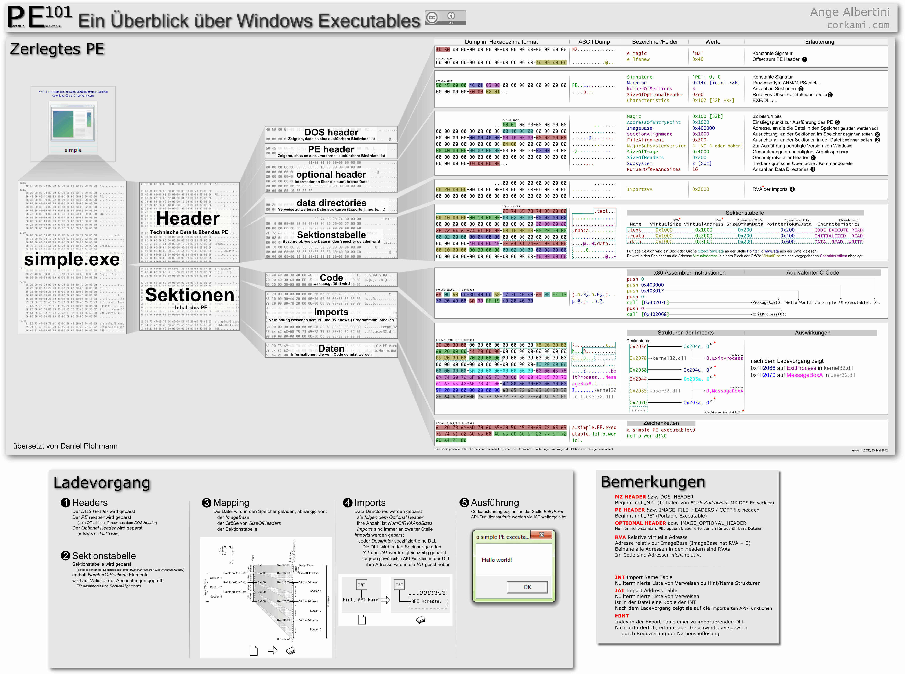
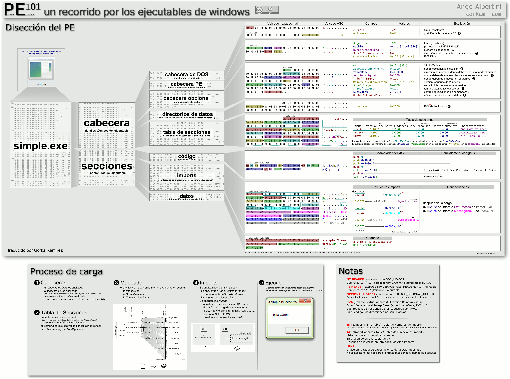
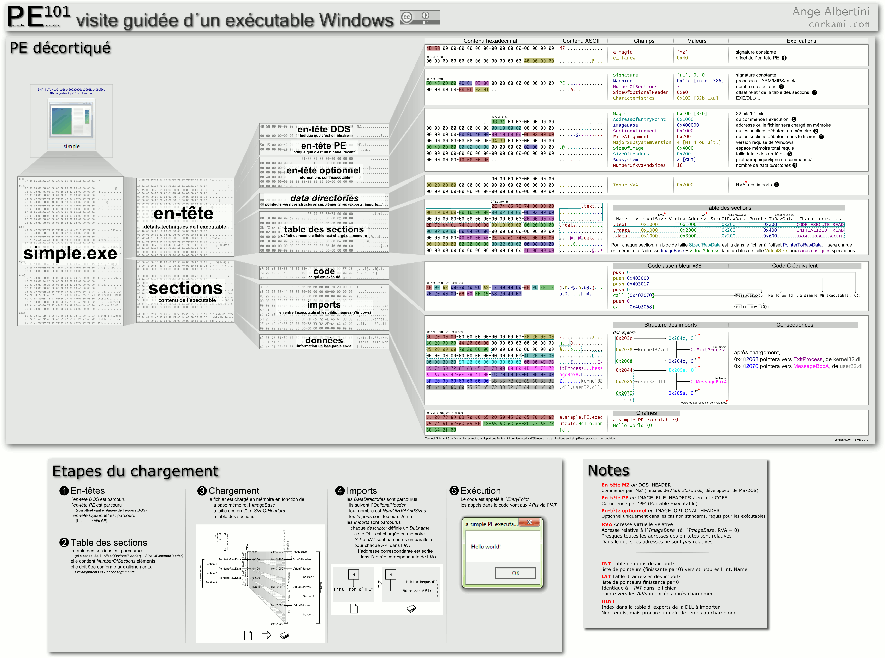
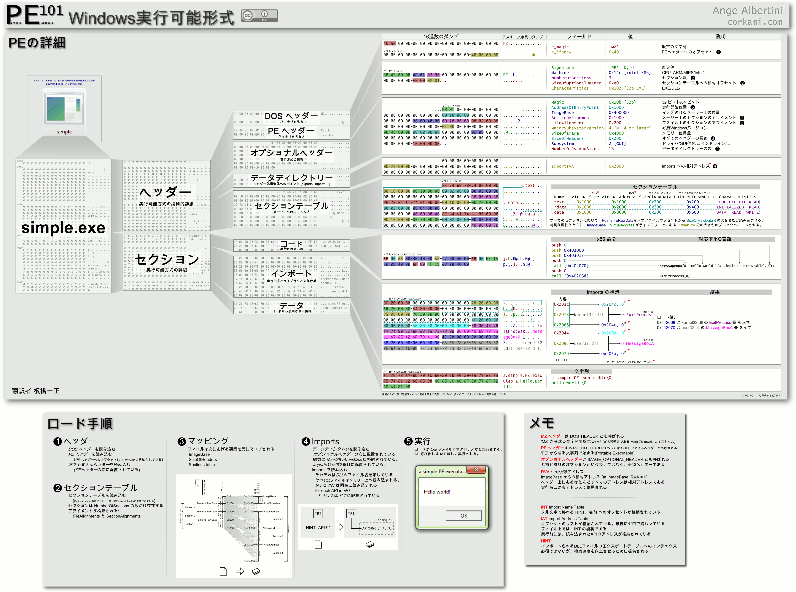
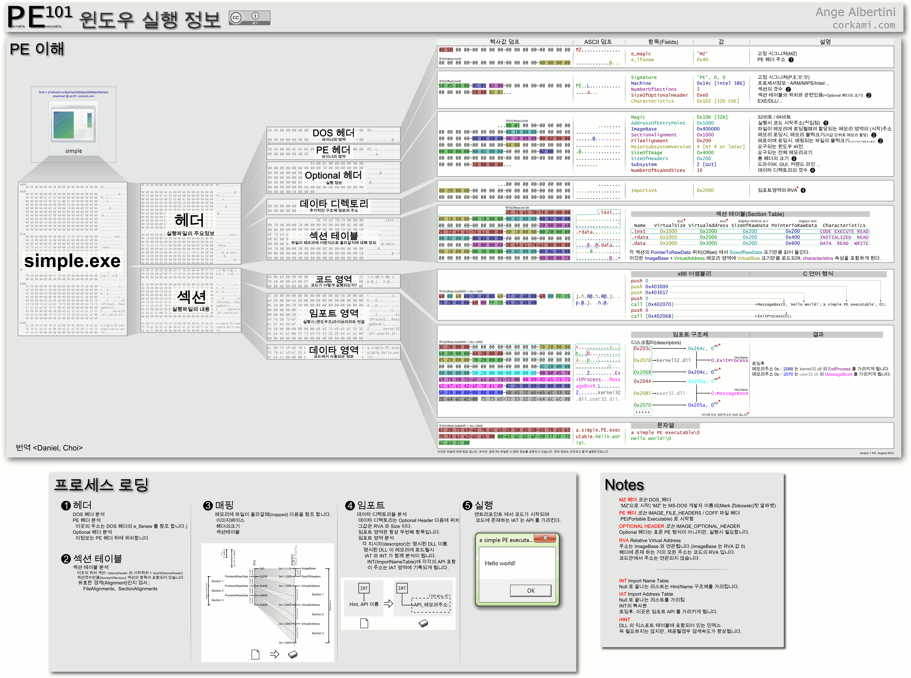
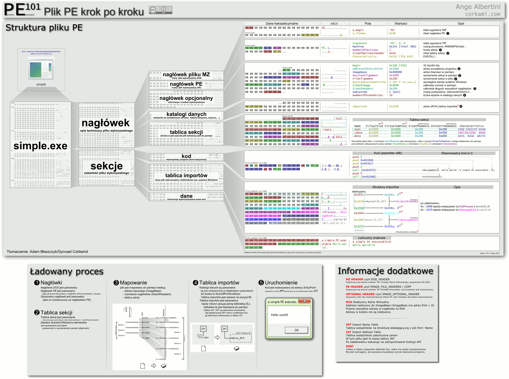
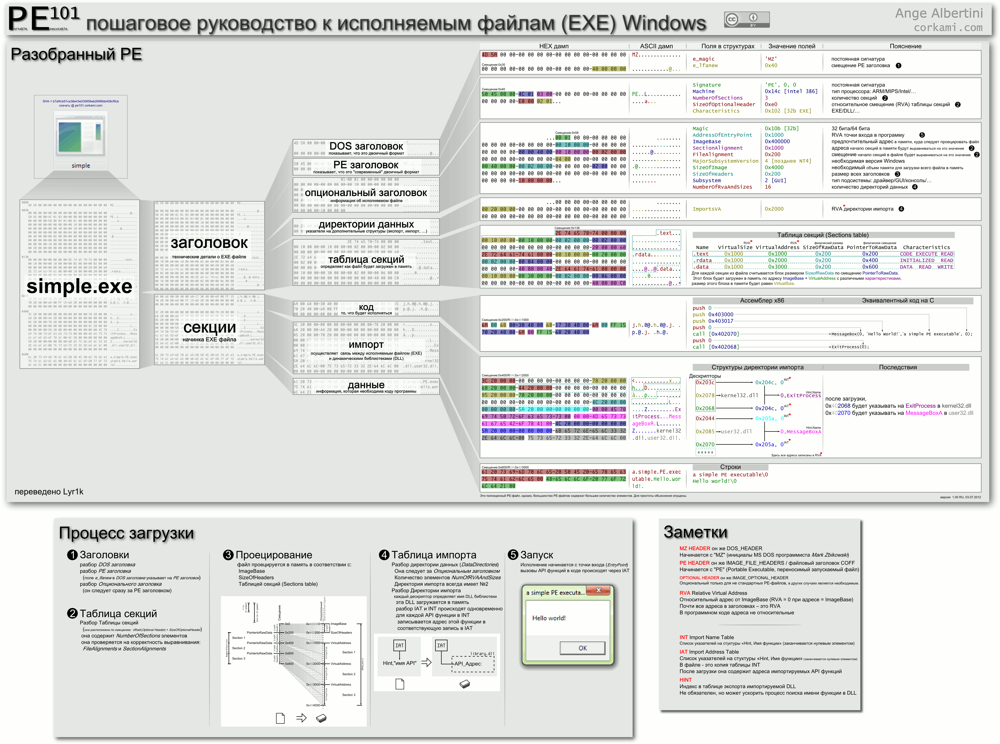

# PE 101 - a windows executable walkthrough

A walkthrough of a simple Portable Executable. 

My first poster ever and my first artwork with Inkscape.

Started in April 2012.

# Alternate versions

## light version

[PNG](pe101l.png) [PDF](pe101l.pdf) [SVG](pe101l.svg)

<kbd></kbd>

## 64 bit version

[PNG](pe101-64.png) [PDF](pe101-64.pdf) [SVG](pe101-64.svg)

# Translations

## Arabic: العربية

تجول خلال ملف ويندوز تنفيذي - وليد عصر
[PNG](pe101ar.png) [PDF](pe101ar.pdf) [SVG](pe101ar.svg)

## German: Deutsch

Ein Überblick über Windows Executables - Daniel Plohmann
[PNG](pe101de.png) [PDF](pe101de.pdf) [SVG](pe101de.svg)

 

## Spanish: Español

un recorrido por los ejecutables de windows - Gorka Ramírez
[PNG](pe101es.png) [PDF](pe101es.pdf) [SVG](pe101es.svg)

## French: Français

visite guidée d´un exécutable Windows
[PNG](pe101fr.png) [PDF](pe101fr.pdf) [SVG](pe101fr.svg)

## Japanese: 日本語

Windows実行可能形式 - 板橋一正
[PNG](pe101ja.png) [PDF](pe101ja.pdf) [SVG](pe101ja.svg)

## Korean: 잉글리시

윈도우 실행 정보 - 번역
[PNG](pe101ko.png) [PDF](pe101ko.pdf) [SVG](pe101ko.svg)

## Polish: Polski

Plik PE krok po kroku v1.1 - Adam Błaszczyk & Gynvael Coldwind
[PNG](pe1011pl.png) [PDF](pe1011pl.pdf) [SVG v1.0](pe101pl.svg)

## Russian: Русский

пошаговое руководство к исполняемым файлам (EXE) Windows - Lyr1k
[PNG](pe101ru.png) [PDF](pe101ru.pdf) [SVG](pe101ru.svg)

## Chinese: 中文

Windows可执行文件详解 - 译者 童进
[PNG](pe101zh.png) [PDF](pe101zh.pdf) [SVG](pe101zh.svg)

