Support me: order [prints](http://prints.corkami.com/), check my [patreon](https://www.patreon.com/corkami).

---
# tracings

---

<a href="toilets.pdf">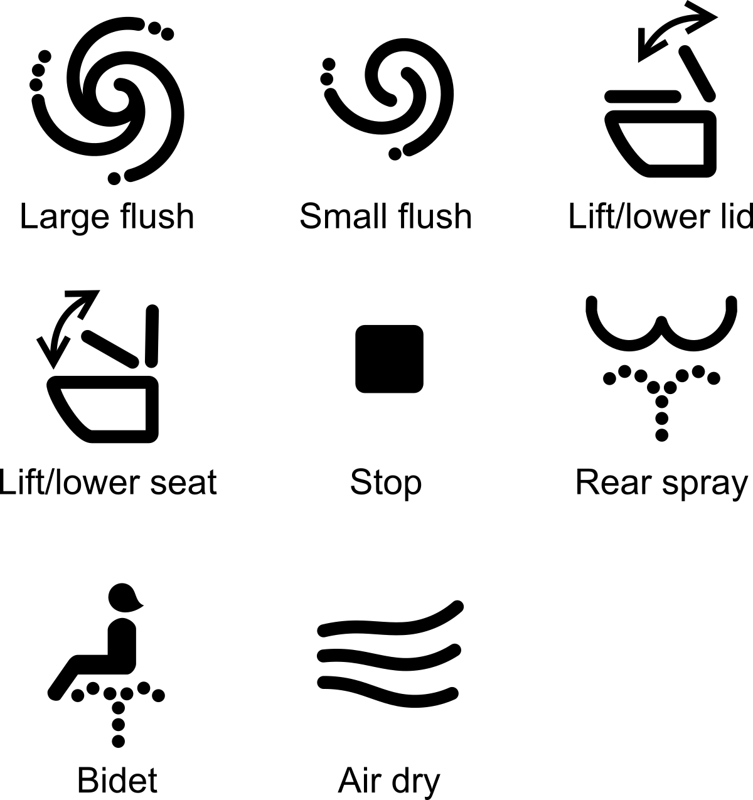</a>

<a href="sneakers.pdf">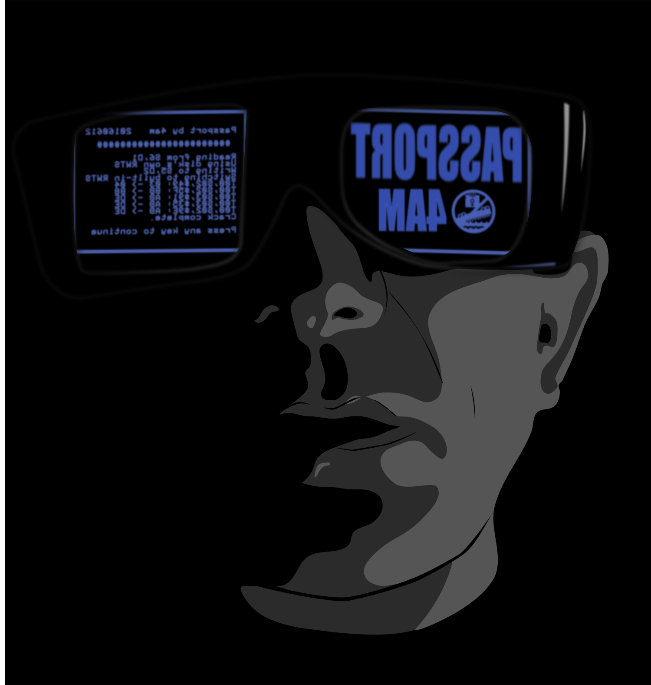</a>
<a href="clippy.pdf">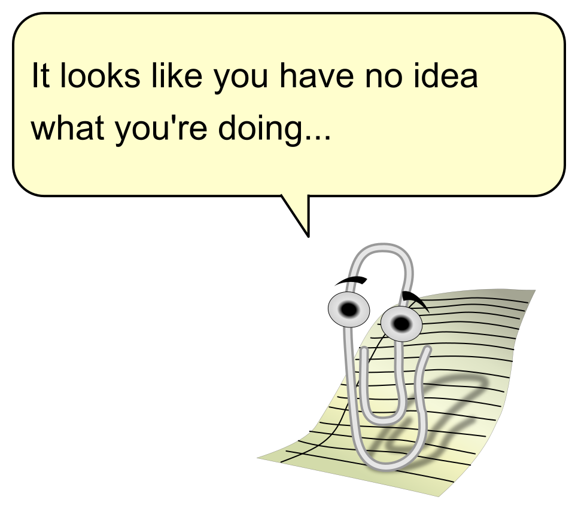</a>

<a href="STIC.pdf">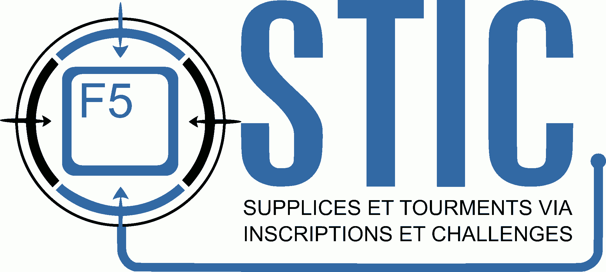</a>
<a href="EmployeesMust.pdf">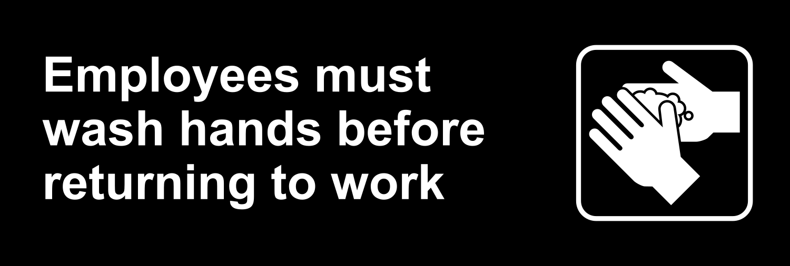</a>
<a href="ReverseEngineer.pdf">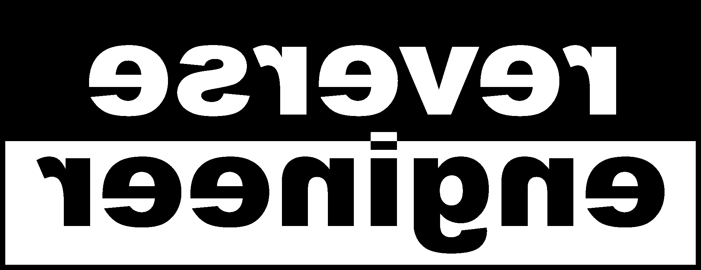</a>

---

<a href="Department.pdf">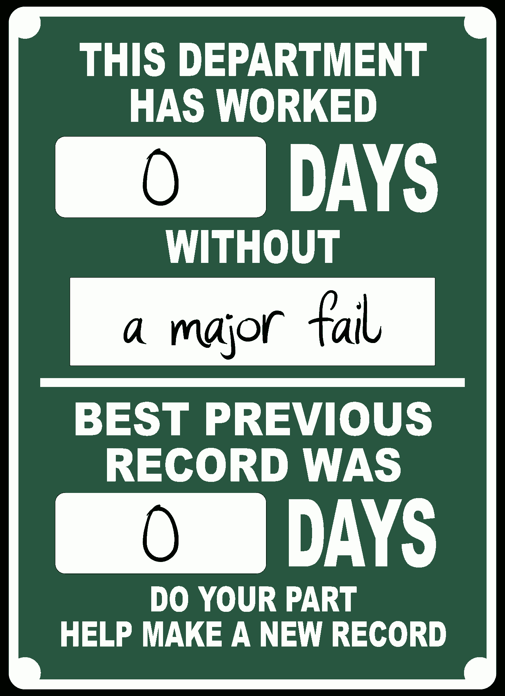</a>

<a href="LightCycle.pdf">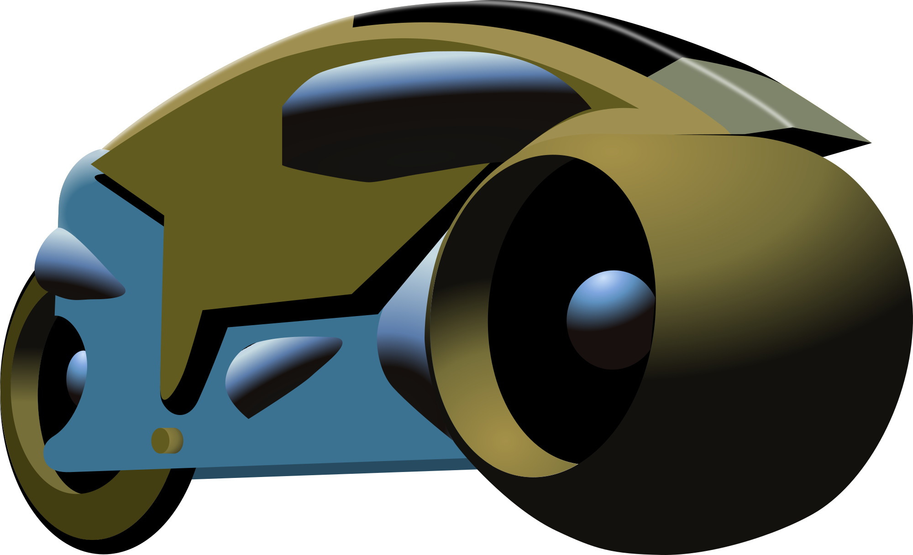</a>

---

<a href="piersolar.pdf">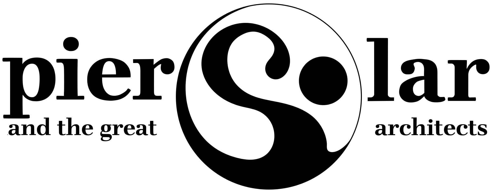</a>

---
# Memes

<a href="meme/KeepSegfault.pdf">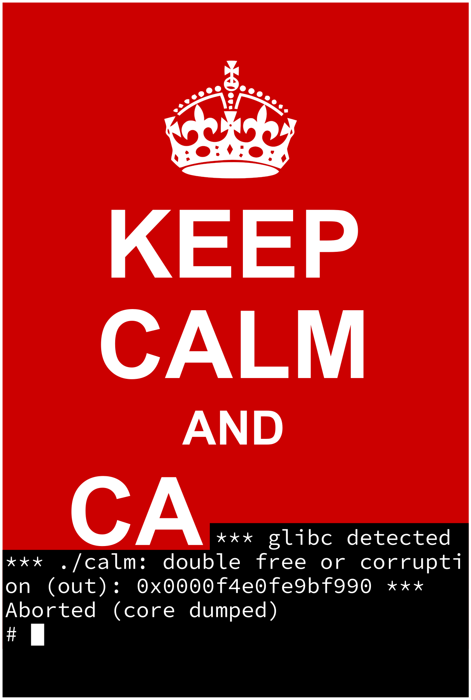</a>
<a href="meme/KeepCalc.pdf">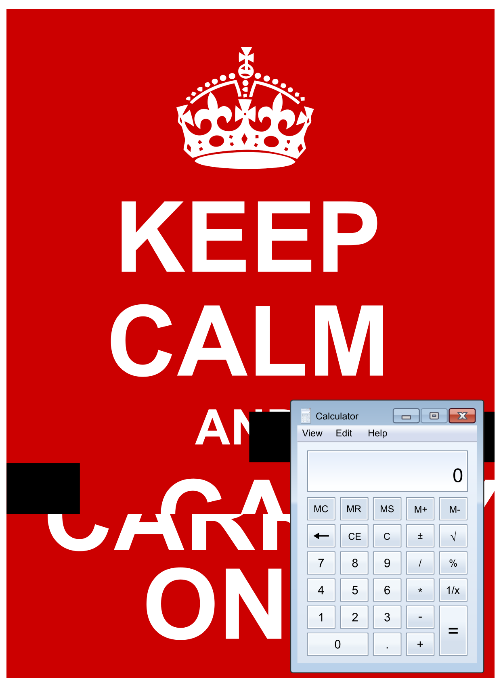</a>

---
# Floppy disks warnings

<a href="floppy/back.pdf">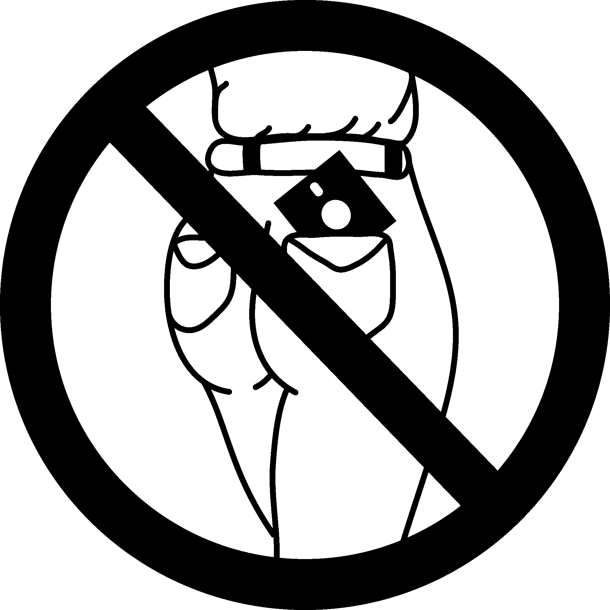</a>

<a href="floppy/toilet.pdf">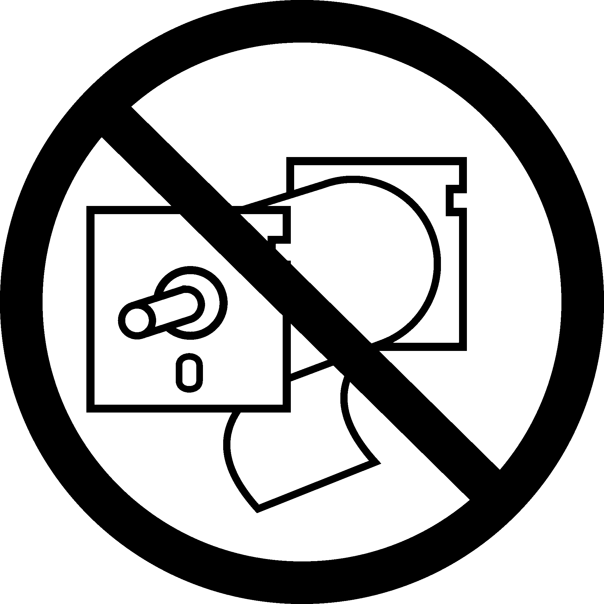</a>

Beagle Bros & Polarware

---
# LaTeX

---
Support me: order [prints](http://prints.corkami.com/), check my [patreon](https://www.patreon.com/corkami).
